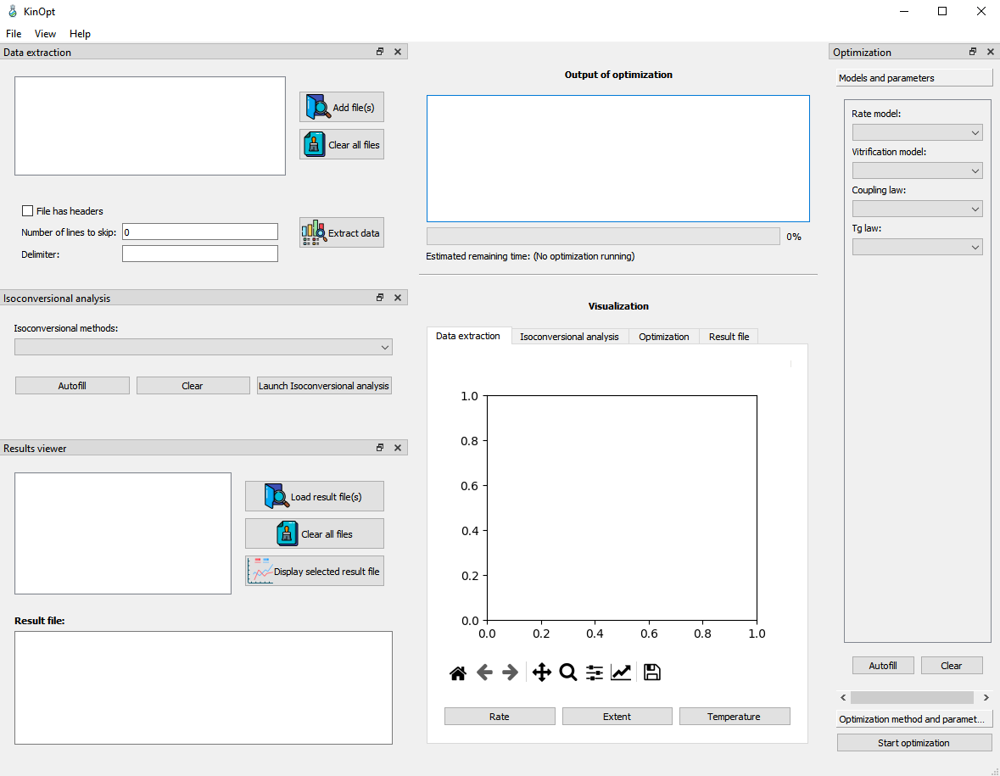

Launching the graphical interface
=================================

To start the graphical interface:

1. Open a command prompt in the '*src*' folder
2. Run the "main.py" script using python.

.. code:: bash

    >> python3 main.py

The GUI should look like this:

This GUI is divided in 5 parts:

1. The data extraction dock
2. The isoconversional analysis dock
3. The results viewer dock
4. The optimization dock (with the model section and optimization section)
5. The central part that display the output of docks